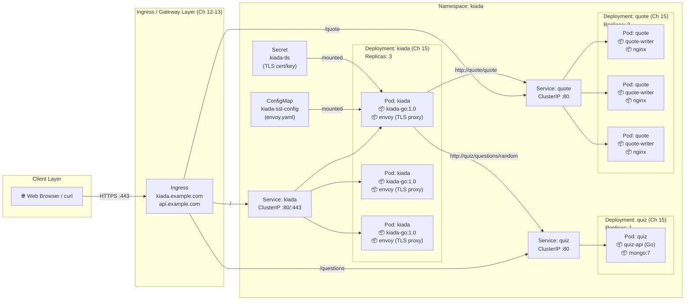
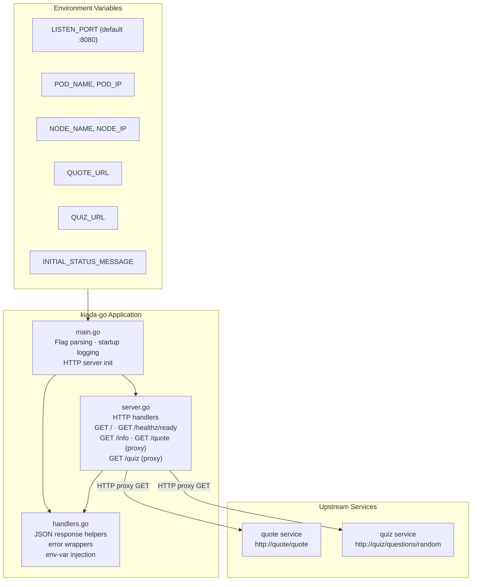
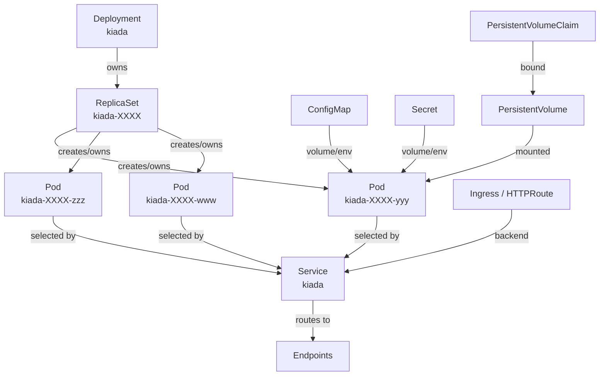
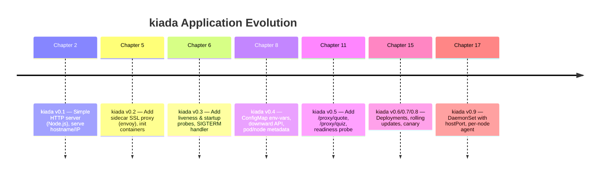

# Kubernetes in Action, 2nd Edition — Architecture & Book Structure

## Book Structure Flowchart

```mermaid
flowchart TD
    BOOK["📚 Kubernetes in Action\n2nd Edition"]

    BOOK --> P1["Part I\nGetting Started with Kubernetes"]
    BOOK --> P2["Part II\nRunning Applications on Kubernetes"]
    BOOK --> P3["Part III\nManaging App Configuration & Storage"]
    BOOK --> P4["Part IV\nConnecting & Exposing Applications"]
    BOOK --> P5["Part V\nManaging Applications with Controllers"]

    P1 --> C1["Ch 1 — Introducing Kubernetes\n(concepts only)"]
    P1 --> C2["Ch 2 — Understanding Containers\nDocker · kiada v0.1 Node.js app\nDockerfile · pod.kiada.yaml"]
    P1 --> C3["Ch 3 — Deploying Your First App\nkubectl · kind cluster · Deployment\ncreate-deployment.sh"]
    P1 --> C4["Ch 4 — Navigating the K8s API\n(concepts only)"]

    P2 --> C5["Ch 5 — Running Apps with Pods\nkiada v0.2 · init containers\nsidecar containers · SSL proxy"]
    P2 --> C6["Ch 6 — Pod Lifecycle & Health\nkiada v0.3 · liveness probes\nstartup probes · SIGTERM handler"]
    P2 --> C7["Ch 7 — Namespaces & Labels\nkiada-suite: kiada + quiz + quote\nnode affinity · annotations"]

    P3 --> C8["Ch 8 — ConfigMaps & Secrets\nkiada v0.4 · env vars · downward API\nTLS secrets · image pull secrets"]
    P3 --> C9["Ch 9 — Volumes\nquiz-api v0.1 Go app · MongoDB\nemptyDir · hostPath · projected"]
    P3 --> C10["Ch 10 — PersistentVolumes\nPVC · StorageClass · VolumeSnapshot\nlocal PV · dynamic provisioning"]

    P4 --> C11["Ch 11 — Services\nkiada v0.5 · ClusterIP · NodePort\nLoadBalancer · headless · DNS"]
    P4 --> C12["Ch 12 — Ingress\nIngress NGINX · TLS · host rules\npath routing · affinity"]
    P4 --> C13["Ch 13 — Gateway API\nHTTPRoute · TLSRoute · TCPRoute\nGateway · ReferenceGrant · Istio"]

    P5 --> C14["Ch 14 — ReplicaSets\nrs.kiada.yaml · pod ownership\nlabel selectors · scaling"]
    P5 --> C15["Ch 15 — Deployments\nkiada v0.6/0.7/0.8 · RollingUpdate\nRecreate · canary · rollback"]
    P5 --> C16["Ch 16 — StatefulSets\nquiz-api v0.2 · MongoDB replSet\nordered/parallel · PVC retention"]
    P5 --> C17["Ch 17 — DaemonSets\nkiada v0.9 · node-agent · hostNetwork\nhostPort · tolerations"]
    P5 --> C18["Ch 18 — Jobs & CronJobs\nquiz-init · aggregate-responses\nindexed jobs · work queues"]

    classDef part fill:#3b82d4,color:#fff,stroke:#2563eb
    classDef chapter fill:#f7f8fa,stroke:#e5e7eb,color:#1f2328
    class P1,P2,P3,P4,P5 part
    class C1,C2,C3,C4,C5,C6,C7,C8,C9,C10,C11,C12,C13,C14,C15,C16,C17,C18 chapter
```

---

## Kiada Application Architecture (End-to-End)

The **kiada** demo application suite introduced progressively across the book chapters:

---

## Go App (kiada-go) Component Diagram

---

## Kubernetes Resource Relationships (Ch 14-17)

---

## Deployment Progression (kiada versions across chapters)

