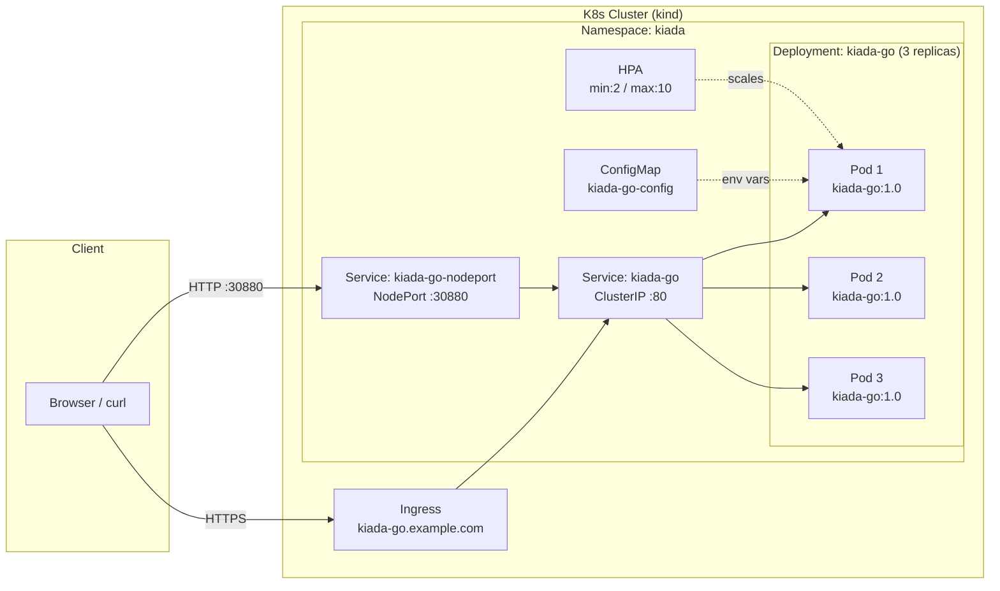

# Kubernetes in Action, 2nd Edition — kiada-go

> **Go re-implementation** of the Kiada demo app from *Kubernetes in Action, 2nd Edition* by Marko Lukša.  
> Built from the patterns and examples found across all 18 chapters of the book.

## Architecture



## API Endpoints

| Method | Path | Description |
|--------|------|-------------|
| `GET` | `/` | Pod name, IP, node info (plain text) |
| `GET` | `/healthz/ready` | Readiness / liveness probe |
| `GET` | `/info` | JSON: pod/node metadata |
| `GET` | `/proxy/quote` | Proxy → `QUOTE_URL` upstream |
| `GET` | `/proxy/quiz` | Proxy → `QUIZ_URL/questions/random` |

## Environment Variables

| Variable | Default | Book Chapter |
|----------|---------|-------------|
| `LISTEN_PORT` | `8080` | Ch 2 |
| `POD_NAME` | (hostname) | Ch 8 — Downward API |
| `POD_IP` | `0.0.0.0` | Ch 8 — Downward API |
| `NODE_NAME` | `unknown` | Ch 8 — Downward API |
| `NODE_IP` | `0.0.0.0` | Ch 8 — Downward API |
| `QUOTE_URL` | *(not set)* | Ch 11 — Services |
| `QUIZ_URL` | *(not set)* | Ch 11 — Services |
| `INITIAL_STATUS_MESSAGE` | *(empty)* | Ch 8 — ConfigMap |

## Project Structure

```
kiada-go/
├── main.go          # Entry-point: startup, graceful shutdown (SIGTERM)
├── server.go        # HTTP router and all request handlers
├── helpers.go       # getEnv() utility
├── server_test.go   # Unit tests
├── go.mod           # Go module (no external deps — stdlib only)
├── Dockerfile       # Multi-stage build (golang:1.21-alpine → alpine:3.19)
├── Makefile         # build / run / test / docker-build / docker-push
└── k8s/
    ├── 00-namespace.yaml   # Namespace: kiada
    ├── 01-configmap.yaml   # ConfigMap: kiada-go-config
    ├── 02-deployment.yaml  # Deployment: kiada-go (3 replicas, rolling update)
    ├── 03-service.yaml     # Service: ClusterIP + NodePort
    ├── 04-ingress.yaml     # Ingress: kiada-go.example.com
    └── 05-hpa.yaml         # HorizontalPodAutoscaler
```

## Kubernetes Concepts Demonstrated

| Manifest | Book Chapter(s) |
|----------|----------------|
| Namespace | Ch 7 — Namespaces & Labels |
| ConfigMap + env injection | Ch 8 — ConfigMaps & Secrets |
| Downward API env vars | Ch 8 — Downward API |
| Readiness + Liveness probes | Ch 6 — Pod Lifecycle |
| Deployment + rolling update | Ch 15 — Deployments |
| ClusterIP + NodePort Service | Ch 11 — Services |
| Ingress | Ch 12 — Ingress |
| HorizontalPodAutoscaler | Ch 14-15 — Scaling |

## Quick Start

See [`Docs/Quickstart.md`](Docs/Quickstart.md) for full step-by-step instructions.

```bash
# 1. Deploy to a local kind cluster
./scripts/launch.sh

# 2. Test
curl http://localhost:30880/
curl http://localhost:30880/healthz/ready
curl http://localhost:30880/info

# 3. Tear down
./scripts/shutdown.sh
```

## Run Locally (without Kubernetes)

```bash
cd kiada-go
go run .
# → http://localhost:8080/
```

## Run Tests

```bash
cd kiada-go
go test ./...
```

## License

MIT — see individual chapter source files for original Node.js code by Marko Lukša.

---
*Made with ❤️ based on [Kubernetes in Action, 2nd Edition](http://kubernetes-in-action.com/second-edition)*
